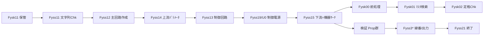

# libfysek.a 移行計画（全体詳細）

- 対象: `toku/sekkei/src` がビルドする静的ライブラリ `../lib/libfysek.a`（特注盤 CAD 設計エンジン本体）
- 目標: C(K&R) 実装を .NET 9 / C# へ忠実移植し、`Fysk10_Main` を「動く設計パイプライン」として再構築する
- 最終更新: 2026-07-31

> 本書は移行の全体像・順序・受け入れ条件を定める上位計画。増分ごとの詳細は
> [docs/name-mapping.csv](name-mapping.csv) と `/memories/repo/ews-migration-roadmap.md`、
> セッション履歴は [docs/HANDOFF.md](HANDOFF.md) を参照。

---

## 0. ベースライン

| 指標 | 値 |
|---|---|
| 構成 | **76 ソース / 約 109,800 行**（`makefile` の `libfysek.a` 依存より） |
| ビルド | `cc -c -g -I{sekkei,common,sin,cmpchg}` → `ar vr ../lib/libfysek.a` |
| 移行先 | `EwsMigration`（.NET 9 / xUnit） |
| 進捗（推定） | 機器サーチ中核 + 入力解析/主回路/上流の一部（**総量比 ~12〜15%**、テスト 1004） |

### 規模上位（移行難所）
`Fysk00`(12,037) / `Fyss1d`(10,482) / `Fysk01`(8,290) / `Fyss14`(7,178) / `Fyss11`(6,415) /
`Fyss1e`(5,940) / `Fyss12`(5,420) / `Fyss1b`(4,741) / `Fyss3G`(4,073) / `Fyss1k`(3,767) /
`Fyss1l`(3,617) / `Fyss1f`(3,566) / `Fyss3D`(2,901) / `Fysk10`(2,827)

---

## 0.1 関連ライブラリ（libfysek.a の外部依存）

`Fysk10_Main` は libfysek.a 単体では完結せず、リンク時に複数の外部ライブラリを必要とする
（libfysek.a ソースからの実際の関数呼出し実態）。
**完全な設計出力の再現には制御設計 `libfysgy.a` の移植が必須**。

| ライブラリ | 役割 | libfysek.a からの呼出 | 移行上の扱い |
|---|---|---|---|
| **libfysgy.a**（`toku/seigyo/src`, 52 ソース / 約 67,000 行） | 制御回路設計 `Fysc20_Sekkei_Control` ほか Fysc2*（制御機器サーチ Mc/Coil/Rry/Switch, MCtype_Change 等） | 15 箱所 | ★**要移植**（制御回路/論理回路出力を生成。M4/M5 の実体） |
| libisam.a / svisam | ISAM エンジン `FyIsam*` | 129 箱所 | インフラ。`IIsamTable`→SQL/固定長で抽象化済 |
| libfycom.a | 共通ユーティリティ `FyGet*`/`Lib*`（LibCharToDouble/CpyNullStop 等） | 273 箱所 | 必要分を移植（Stof/Stoi/地区/パス は済） |
| libclhbn.a | 品番 ISAM `ClIsam*`/`FyCpHbHbnInfFileR` | 約 6 箱所 | 品番情報は一部移植済（PartNumberInfoLoader） |
| libfysin.a / kairozu | 作図/回路図連携 | 0（ヘッダの構造体・定数参照のみ） | ロジック移植不要 |

**総スコープ（設計エンジン一式）**: libfysek.a(~110k) + libfysgy.a(~67k) ≒ **約 177,000 行**。

> **相互依存（重要）**: `libfysgy.a`（制御設計）は逆に `libfysek.a` を呼び返す。特に機器サーチ
> `Fysk00_Kikisearch_SY` / `Fysk01_Kikisearch_S1`（24 箇所）を利用するため、**移植済みの機器サーチ①②は
> 主回路・制御回路の両設計が共用する基盤**となる（＝ libfysek.a ↔ libfysgy.a は双方向依存）。
> libfysgy.a のその他外部依存は libfysek.a とほぼ同一（libisam `FyIsam*` 34 / libfycom `Lib*`236・`FyGet*`23 /
> libclhbn `ClIsam*`）＋ 少量の kairozu(`CrCtlCns015Get` 4)・libfysin(`FySinCmpHbnRead` 2)。
> Motif(`Xm`/`Xt`)・compo(`cmplogtr`/`cmpsmart`) はヘッダ参照のみ（0 呼出）でロジック移植不要。

---

## 0.2 進捗トラッキング（毎増分更新）

各増分（1 関数移植）ごとに本表を更新する（テスト数・移植エントリ数は正確値、移植率は概算）。

| 指標 | 現在値 | 総量/目標 |
|---|---|---|
| テスト成功数 | **1384** | 0 失敗 / 0 スキップを維持 |
| 移植エントリ数（name-mapping.csv 行数） | **569** | — |
| 推定移植率（libfysek.a ~110k + libfysgy.a ~67k ≒ 177k 行） | **~14〜17%** | 100% |
| 直近コミット | `60c5e76` | — |
| 最終更新 | 2026-08-05 | — |

> フェーズ別の詳細状況は §4 のフェーズ表（✅/🟡/❌）で管理し、フェーズ/マイルストーン達成時に併せて更新する。

---

## 1. ターゲット・アーキテクチャ

```
Ews.Domain    … モデル(POCO)/構造体。依存なし。ISAM レコード = IIsamRecord
Ews.Data      … ローダ/リポジトリ/ISAM 抽象(IIsamTable, SQL 実装)。→ Domain
Ews.Analysis  … 設計ロジック(Fysk*/Fyss* 本体)。→ Domain, Data
Ews.App.Batch … パイプライン起動(= Fysk10_Main 相当のジョブ)
Ews.Tests     … xUnit。C 原典と 1 対 1 の忠実性テスト
```

- C 構造体 → `sealed class` / `record`（ポインタ・calloc/free は GC 管理へ）
- ISAM(`FyIsam*`) → `IIsamTable` / リポジトリ（固定長エクスポート or SQL Server）
- cns 定数ファイル → ローダ（CP932 解析）
- グローバル変数(CMP_1/2/3 等) → 受け渡し可変状態（`RatingComparisonState` 方式）

---

## 2. 移行原則

1. 忠実移植優先（アルゴリズム・分岐・境界値を C 原典と一致。改善は後回し）
2. バイト単位の桁処理（keta = バイト位置。CP932 固定長を厳守）
3. TDD（各増分で xUnit。日本語メソッド名は数字始まり不可）
4. 小さな増分 + 逐次コミット（name-mapping.csv / repo メモリを毎増分更新）
5. ゴールデンマスタ検証（§7）
6. 下請けは bottom-up、パイプラインは top-down で結線
7. エンコーディング: `.cs`/`.csv`/`.sql` = CP932/BOM 無/CRLF、`.md`/`.json` = UTF-8

---

## 3. 依存順序（Fysk10_Main パイプライン）



機器サーチ(Fysk00/01/02/04)は最深部だが移行は**先行完了**。残りは主に
上流 → 制御 → 下流結線 → 検証 → 線番 の縦断結線。

---

## 4. フェーズ別計画

凡例: ✅ 完了 / 🟡 部分 / ❌ 未着手

### フェーズ 0 — 基盤・共通
| ファイル(行) | 役割 | 状況 |
|---|---|---|
| Fysscommon(522), FyskTool(497), Fyskd820(221) | 共通関数/ツール/d820 | 🟡 一部(Formatter 系) |
| Fysk07(591), Fysk08(332), Fysk09(102) | ファイル入出力/構成読込 | ❌ |
| Fysk0c(180),0d(181),0e(138),0f(56), Fyss0b(147) | 機器選定/設計 共通 | 🟡 一部 |
| Fysk11(569) | 回路情報保管 | ✅ `CircuitDescriptionArea` |

### フェーズ 1 — 入力解析（Fyss11 系, 約 23,600 行）
| ファイル(行) | 役割 | 状況 |
|---|---|---|
| Fyss11(6415), Fyss1a(1258), Fyss1b(4741), Fyss1c(510), **Fyss1d(10482)**, Fyss1m(145), Fyss1n(165) | 系統文字列チェック（回路記述 → 系統/行種/仕様/機器テーブル展開） | 🟡 `CircuitStringChecker`(P/PS/UP/BN/NP 済、制御文 C・一部 Chk TODO) |

**最大の難所は Fyss1d**（サブチェック群）。

### フェーズ 2 — 主回路エリア作成（Fyss12 系, 約 10,000 行）
| ファイル(行) | 役割 | 状況 |
|---|---|---|
| Fyss12(5420), Fyss1f(3566), Fyss1q(589),1r(131),1s(111),1t(131) | 主回路/複合回路エリア作成・数量分解・ランク | 🟡 `MainCircuitBuilder`(Make_Main/ランク/SEP・CT・WH・ZCT 追加 済) |

### フェーズ 3 — パラメータ生成（Fyss14/15/16/40/41/1e/1h/1i 系, 約 25,000 行）
| ファイル(行) | 役割 | 状況 |
|---|---|---|
| **Fyss14(7178)**, Fyss40(757), Fyss41(146), Fyss15(881), Fyss16(1530) | 上流/下流パラメータ・機器選定後処理 | 🟡 `UpperParameterBuilder`/`CircuitParameterResolver`/`VoltageInheritance`/`SecondaryParameterSetter`/`CircuitElementResolver` 部分 |
| **Fyss1e(5940)**, Fyss1h(535),1g(78), Fyss1i(309) | タイプのデフォルト値/電源種類/CT 電流 | 🟡 一部 |

**Fyss15_Make_LowerParm（機器サーチ結線）が最重要結節点**。

### フェーズ 4 — 機器サーチ（Fysk00/01/02/03/04/0a, 約 22,600 行）
| ファイル(行) | 役割 | 状況 |
|---|---|---|
| **Fysk00(12037)** | 機器検索前処理 Prop* | ✅ ①完了（`PropSetSmartType` のみ残） |
| **Fysk01(8290)** | マスタ検索 Kikisearch_S1/Chokisearch | ✅ ②（ALL/BRK/MTG/PBS/CT。**SC** と MC/MG 容量ﾌｨﾙﾀ残） |
| Fysk02(1446) | 定格値チェック | ✅ `RatingValueChecker` |
| Fysk03(373), Fysk04(115), Fysk0a(194) | 補助/キー生成/入力 Chk | ✅ 概ね |

**残**: SC 検索(`Fysk02_Check_Teichi_SC2`+`Chokkin_Read_Check2`+`PropSelChkSc`)、MC/MG 容量選定(`PropSelChkMcMg` 系 + cns)、CT/AM の LW 選定(cns)、接点計算(`Get_Seten_GoodData`)、制御用 `Kikisearch_S2` / 特別予約語 `Kikisearch_T`/`Kikisearch_P`。

### フェーズ 5 — 制御回路（Fyss13/1k/1l, 約 7,600 行）
| ファイル(行) | 役割 | 状況 |
|---|---|---|
| Fyss13(212), **Fyss1k(3767)**, **Fyss1l(3617)** | 制御回路エリア作成/制御仕様テーブル（sekkei 側） | ❌ |

### フェーズ 5b — 制御回路設計 libfysgy.a（Fysc20 系, 別ライブラリ, 52 ソース / 約 67,000 行）
`Fysk10_Main` が主回路設計の後段で呼ぶ制御回路/論理回路の生成本体（`toku/seigyo/src`）。
| ファイル(行) | 役割 | 状況 |
|---|---|---|
| **Fysc23(6364)**, **Fysc22(5759)**, **Fysc2M(3815)**, **Fysc2TSU(3756)**, Fysc20/21/27/2C/2K/2L ほか全 52 ソース | Fysc20_Sekkei_Control 本体 + 制御機器サーチ（Mc/Coil/Rry/Switch）/ 論理回路展開 | ❌ |

### フェーズ 6 — 制御電源・スマート（Fyss19/1p/U0, 約 1,000 行）
| ファイル(行) | 役割 | 状況 |
|---|---|---|
| Fyss19(571), Fyss1p(170), FyssU0(245) | 制御電源取込/LACSL/スマートユニット | ❌ |

### フェーズ 7 — 検証・後処理・複合展開（約 12,000 行）
| ファイル(行) | 役割 | 状況 |
|---|---|---|
| Fyss05(960), Fyss06(273) | 複合回路作成 | ❌ |
| Fyss17(913), Fyss18(1660), Fyss21(192), Fyss22(196) | 論理図/TB 挿入/終了処理 | ❌ |
| Fyss30-39(≈5000): Fyss31(1076),33(572),36(832),37(939),39(757) ほか | 制御発生設定 等 | 🔶 **Fyss31 負荷発生元設定 本体移植**（LoadSourceSelector.SetLoadSource=Fyss31_FukaHassei_Set / set_error=MakeError / set_denryu・set_fky・get_ep・FYRT812 は移植済 / searchsgy→SearchAgainFlag 追加 / CT-AM特殊コピー・改訂<1><2><3><4><9>・951005上流遡り・1-2型dt_pntエラー を忠実移植。SC_Keitou_Proc(Fyss39/Fyss3A依存)はデリゲート境界化）。**Fyss33 完了**(EquipmentSelectionKindSetter)。**Fyss36 完全移植完了**(AccumulationAreaSetter.SetTerminalCircuitCurrent=Fyss36_MattanKairo_Iset 本体4ループ統括+サブ全移植。SC積算はFyss3A委譲境界)。**Fyss3A 完全移植完了**(ScNtUpstreamAccumulator=SC/NT上流積算6関数。Fyss31/Fyss36のデリゲート境界を実体化)。Fyss37完了(TerminalCurrentIntegrator) / 他 ❌ |
| 検証 Prop 群(WhmChk/LgtChk/SenChk/LaClassChk/SpdFuseChk/BunkiHfChk/BunMcChk/LampKeiChk 等) | Fysk10 内の妥当性検証 | ❌ |

### フェーズ 8 — 線番付与・回路設計出力（Fyss3* 系, 約 12,300 行）
| ファイル(行) | 役割 | 状況 |
|---|---|---|
| **Fyss3G(4073)**, **Fyss3D(2901)**, **Fyss3C(2397)**, Fyss3R(586), Fyss3F(370), Fyss3A(363),3B(211),3E(213),3H(317),3I(168) | 回路設計処理/線番系統変更 | 🟡 **Fyss3G ✅完全移植完了**（CNS/Seek/Check/全セッタ/ディスパッチャ本体）/ **Fyss3B ✅完全移植完了** / **Fyss3R ✅完全移植完了**（プラグイン判定 FyHcPlugInJdgType＋グルーピング PropGrouping＋結線処理 Kes_Set/PropSetSouFor1sou/3sou＋主幹チェック MainChk。FYDF805(NOTHING判定)・LibTreeSrch(親検索)はデリゲート境界化）/ 他は ❌ |
| Fyss3P(332), Fyss3Q(194) | 線番付与/線番ファイル更新 | ❌ |

### フェーズ 9 — オーケストレータ結線（Fysk10, 2,827 行）
- `Fysk10_Main` 本体: 段階結線・メモリ管理・CT 自動生成の `while(1)` 再生成ループ・エラー集約・
  機械連動子(`PropMiSearch`/`PropMiEdit`)・INV 無効化(`PropIgnoreForInverter`)。
- 現状: `CircuitAnalyzer` は縦断パイロット骨組みのみ。全フェーズ結線後に完成。

---

## 5. マイルストーン（推奨順序）

| M | 内容 | 依存 |
|---|---|---|
| **M1** | 機器サーチ完全化（SC + MC/MG 容量 + 接点計算 + S2/T/P） | フェーズ4残 |
| **M2** | **Fyss15_Make_LowerParm 結線**（機器サーチを実パイプラインへ） | M1, フェーズ3 |
| **M3** | 入力 → 主回路 → 上流 → 下流の縦断疎通（Fysk10 最小パイプライン） | フェーズ1-3 + M2 |
| **M4** | 制御回路（Fyss13/1k/1l + Kikisearch_S2）と **制御設計 libfysgy.a（Fysc20 系, ~67k 行）** | フェーズ5/5b |
| **M5** | 制御電源・検証 Prop 群・複合展開 | フェーズ6-7 |
| **M6** | 線番付与・回路設計出力（Fyss3*） | フェーズ8 |
| **M7** | Fysk10_Main 完全結線 + ゴールデンマスタ全通過 | 全部 |

---

## 6. 横断的課題

- **ISAM/データ**: 直近上下位(FYDF812)/機器マスタ(FYDM805)/物件(FYDF801)/予約語(FYDF810) 等は
  固定長エクスポート or SQL Server 化（`IIsamTable` 実装済）。全マスタの本番データ供給ルートを確定。
- **cns 定数**: sel_*.cns / eigyocd.cns / whm_sentei.cns など多数。ローダ標準化（CP932）。
- **グローバル状態**: CMP_1/2/3・exekbn・m_pnl・seisakushiyou・mi[] 等 → 受け渡し状態化。
- **メモリ/ポインタ**: calloc/free/親相対参照(Find_Parent) → List/index に置換。
- **数値整形**: sprintf 桁上書き・atoi/atof の忠実再現（`Stoi`/`Stof`/`Formatter` 継続利用）。

---

## 7. 検証戦略（ゴールデンマスタ）

**方式（確定）: `Fysk07_File_Write_ALL` が出力する 5 つの固定長ファイルをバイト比較**する。
`test_tool/FyskMain.c` の FYRT800/805 生ダンプは不具合のため使わない。**まずは 5 ファイル比較のみで進める**
（エラー FYRT805 の突合・段階別中間スナップショットは後続で拡張）。

**比較対象（Fysk07_File_Write_ALL）**:
| 出力 | 構造体 | 内容 |
|---|---|---|
| FNAME_SY → **FYDF806** | syukairo | 主回路（=FYRT800.dt。sk_work 積算は含まない） |
| FNAME_FU → **FYDF807** | fukugo | 複合回路 |
| FNAME_SE → **FYDF808** | kikijg | 制御回路 |
| FNAME_RO → **FYDF809** | ronzu | 論理図面回路 |
| FNAME_KO → **FYDF811** | kosekiki | 構成機器 |

**手順**:
1. C 側で `Fysk10_Main` → `Fysk07_File_Write_ALL` を代表物件で実行し、上記 5 ファイルを取得。
2. 同一入力を C# パイプラインに与え、C# 版の出力ライタ（= `Fysk07` 相当、FYDF806-811 固定長シリアライズ）で 5 ファイルを生成。
3. **CP932 バイト比較**。差分は回路（レコード）単位で自動レポート。

**必須の前処理・移植（5 ファイル比較を成立させる条件）**:
- **datajg 領域のマスク**: 各レコードの登録情報（termid/date/time・変更 date/time, `Fysk07_Set_Datajg`）は
  実行ごとに変わり得るため、比較前にマスク（または入力物件の日時を固定）。
- **出力時変換の移植**: `Fysk07_File_Write_RO` の改訂&lt;1&gt;（COS/SSW かつ vc=105 かつ meisyou="試験" → "入"）等、
  書き込み時の最終加工も C# 出力ライタに再現する（設計ロジックではなく出力ライタの一部）。

**受け入れ条件**: 代表物件群で 5 ファイルがバイト一致。

**後続拡張（保留）**: (a) 戻り値 0/1/2 とエラーエリア(FYRT805/Perra)の突合、
(b) 段階別中間スナップショット（Fyss11 後/Fyss12 後…）による乖離局所化。

---

## 8. リスク

| リスク | 対策 |
|---|---|
| 巨大ファイル(Fysk00/Fyss1d/Fysk01/Fyss14) | 関数単位に細分化、リーフから bottom-up |
| グローバル状態の暗黙依存 | 状態オブジェクト化 + 段階間 I/O 契約を明文化 |
| ISAM 本番データ供給 | 早期にエクスポート/SQL 供給ルートを確立 |
| ビルド分岐(LAMP22 等) | 本番定義に固定（既定 LAMP22 有効の前提を継続確認） |
| 浮動小数/桁上書きの微差 | ゴールデンマスタでバイト一致を必須化 |

---

## 9. 直近の推奨アクション

機器サーチ①②が揃った今、最効率は **M2「Fyss15_Make_LowerParm 結線」**。これで移植済みの機器サーチが
実パイプラインに初めて繋がり、`Fysk10_Main` の縦断疎通(M3)に前進する。並行して **M1 の SC 検索前提
(`Fysk02_Check_Teichi_SC2`)** を潰すと機器サーチが完全化する。
